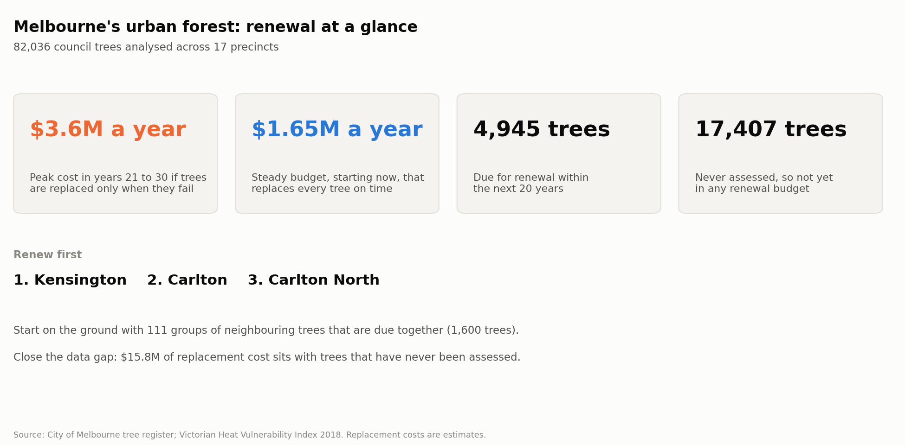
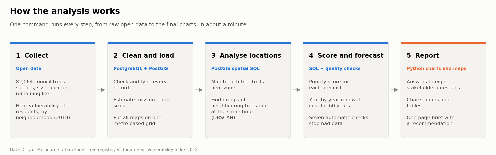
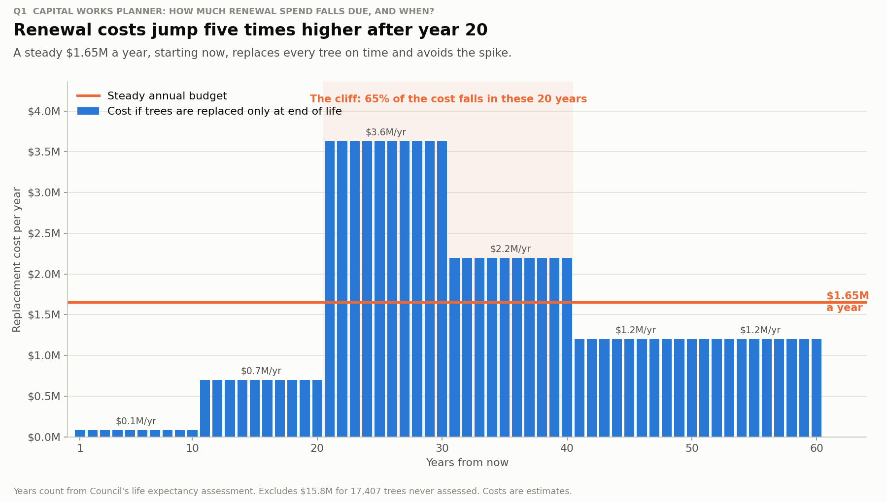
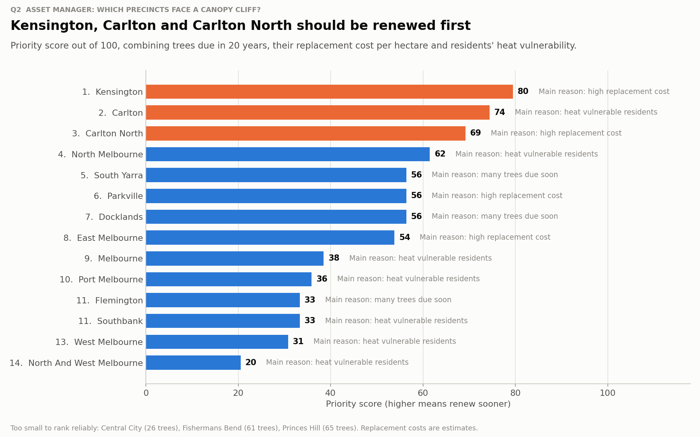
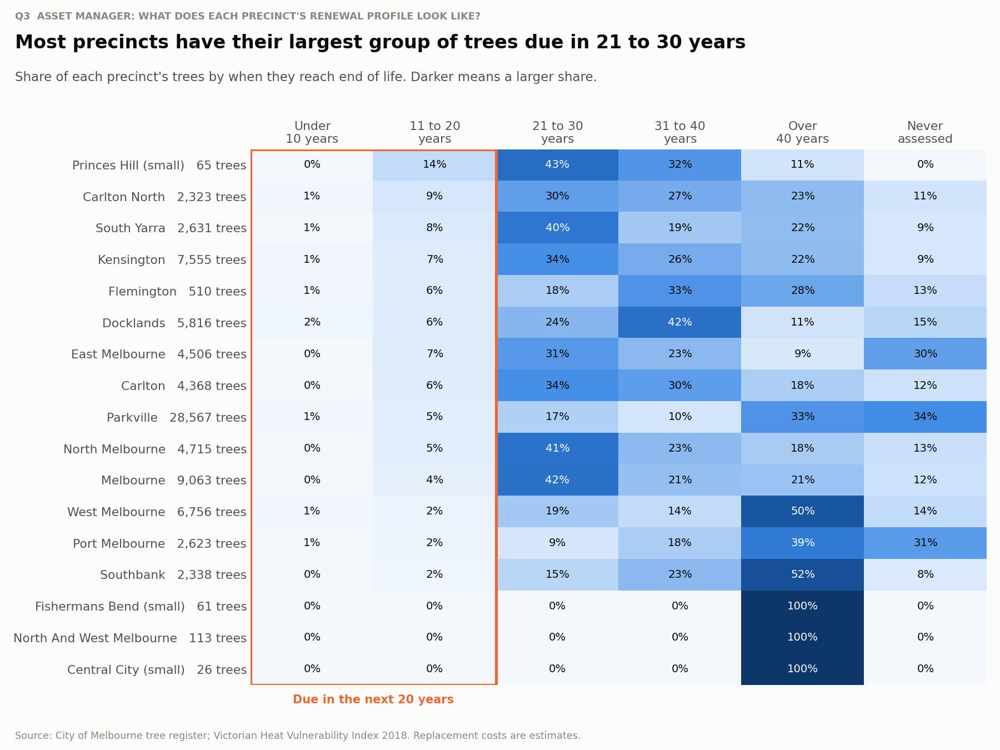
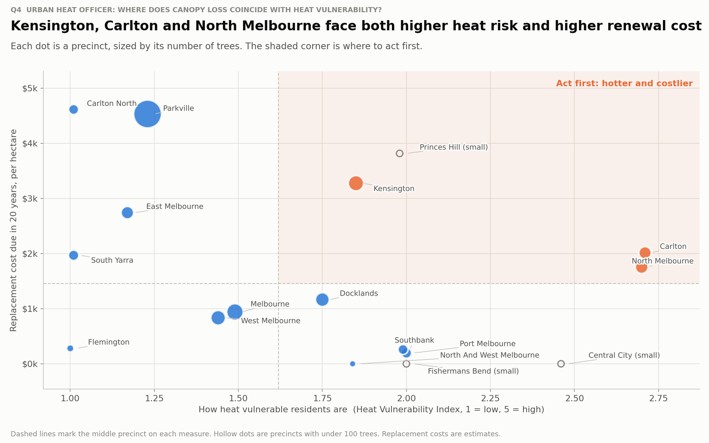
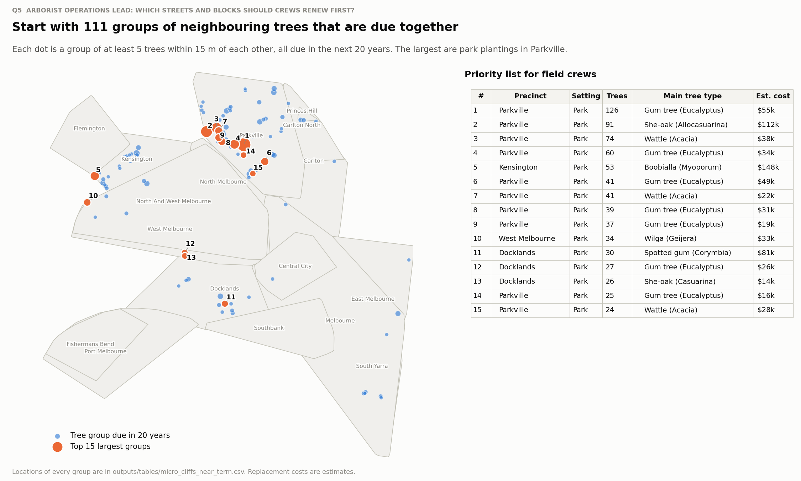

# Melbourne Urban Forest Renewal Plan

**Where will Melbourne lose its street trees all at once, what will it cost, and who will feel the heat?**

This project turns the City of Melbourne's register of 82,064 council trees into a forward-looking renewal plan. It finds precincts and streets where large groups of trees will reach the end of their life together, a *canopy cliff*. It prices the renewal and weighs it against how vulnerable local residents are to heat.

**Read the one-page recommendation: [docs/canopy_cliff_brief.md](docs/canopy_cliff_brief.md)**



## The problem

Much of Melbourne's canopy was planted in waves, so trees of the same age grow old together. Council records how long each tree has left, but that information is rarely turned into a long-term budget. Without a plan, whole neighbourhoods lose their shade in the same few years. The result is a sudden replacement bill, felt most by the residents most vulnerable to heat.

## What was done

- Combined the tree register with the 2018 Heat Vulnerability Index in a PostGIS database, and matched every tree to its neighbourhood.
- Found groups of neighbouring trees due for renewal at the same time, using spatial clustering (DBSCAN).
- Scored every precinct from 0 to 100, and forecast renewal cost year by year for 60 years.
- Answered eight stakeholder questions with charts written for a non-technical audience.



## Skills demonstrated

- **Spatial SQL and PostGIS:** point-in-polygon joins, nearest-neighbour search, DBSCAN clustering, hulls and area calculations, all indexed and in one metric coordinate system.
- **Data pipeline design:** a layered database (raw, reference, clean, results), a full rebuild from one command, and Docker for reproducibility.
- **Data quality:** profiling the source data, estimating missing values, and seven automatic checks that stop the pipeline on bad data.
- **Asset renewal forecasting:** a 60-year capital expenditure profile, a levelled budget and a precinct risk ranking.
- **Stakeholder communication:** eight stakeholder questions, plain-language charts and a one-page brief with a recommendation.

## Key design decisions

- **Trees are clustered separately for each renewal period.** Clustering all trees together only rediscovers dense parks and avenues. Clustering within each period means a cluster is a group of trees that will be lost at the same time, which is the actual risk.
- **Precincts with fewer than 100 trees are not ranked.** In a tiny precinct, a handful of trees can swing the score. Princes Hill first ranked number one on 65 trees and dropped to number 16 under one alternative assumption. Small precincts are shown as a watch list instead.
- **The score uses percentile ranks.** Cost, share of trees and heat are measured in different units. In inner Melbourne, heat scores only range from 1 to 3, so a raw multiplier let cost decide everything. Percentile ranks give each measure a fair say.
- **Missing trunk sizes are estimated, not ignored.** 55 percent of trees have no trunk size. Leaving them out would have given no cost to about 40 percent of the trees due soon. Each is estimated from similar trees, and the estimate is flagged.

## Tech stack

| Area | Tools |
|---|---|
| Database | PostgreSQL 16, PostGIS 3.4 (also runs on Supabase) |
| Spatial | PostGIS SQL, GDAL `ogr2ogr`, GDA2020 / MGA zone 55 (EPSG:7855) |
| Languages | SQL, Python 3.11, Bash |
| Python | pandas, NumPy, psycopg2, Matplotlib, adjustText, folium, scikit-learn |
| Environment | Docker, Docker Compose |

## Results

### Q1. How much renewal spend falls due, and when?
Costs are low for 20 years, then jump five times higher. A steady **$1.65M a year**, starting now, avoids the spike.



### Q2. Which precincts should be renewed first?
**Kensington, Carlton and Carlton North.**



### Q3. When are each precinct's trees due?
Most precincts have their largest group of trees due in 21 to 30 years.



### Q4. Where does canopy loss coincide with heat vulnerability?
Kensington, Carlton and North Melbourne face both higher heat risk and higher renewal cost.



### Q5. Which streets and blocks should crews renew first?
There are 111 groups of neighbouring trees due together. The largest are park plantings in Parkville.



### Q6 to Q8. Tree types, data confidence and robustness
- [Gum trees and elms make up 40 percent of trees due soon](outputs/figures/07_tree_types_due_soon.png).
- [21 percent of trees have never been assessed](outputs/figures/08_data_confidence.png).
- [Kensington stays in the top two under every alternative assumption](outputs/figures/09_ranking_robustness.png).

Also available:
- the [heat and cost map](outputs/figures/05_heat_and_cost_map.png);
- an [interactive map](outputs/maps/canopy_cliff_map.html) (download it and open it in a browser).

## Running it

```bash
cp .env.example .env
# Download the source data into data/ (see below)
docker compose up -d db
docker compose run --rm app scripts/run_pipeline.sh
```

A full run takes about a minute and rebuilds everything in `outputs/`.

| Folder | Contents |
|---|---|
| `sql/` | Pipeline steps 00 to 09, then quality checks. Assumptions live in `02_load_reference_data.sql` |
| `analysis/` | Tables, charts and maps |
| `scripts/` | `run_pipeline.sh` and the shapefile loader |
| `docs/` | Brief, requirements and images |
| `outputs/` | Generated charts, maps and tables |

## Assumptions and limitations

- Replacement costs are estimates, from $400 to $6,000 per tree by trunk size, not council procurement rates.
- 21 percent of trees have never been assessed. Their $15.8M cost is reported separately.
- Timelines count years from Council's life expectancy assessment, not calendar years.
- Precinct shapes are drawn around their trees, because there are no official boundaries.

## Data sources

| Dataset | Publisher | Licence |
|---|---|---|
| [Trees, with species and dimensions](https://data.melbourne.vic.gov.au/explore/dataset/trees-with-species-and-dimensions-urban-forest/) | City of Melbourne | CC BY 4.0 |
| [Heat Vulnerability Index 2018](https://discover.data.vic.gov.au/dataset/metropolitan-melbourne-heat-vulnerability-index-2018) | Victorian Department of Transport and Planning | CC BY 4.0 |

1. Save the tree register as `data/trees_raw.csv`, using the semicolon-delimited CSV export.
2. Extract the Heat Vulnerability Index shapefile into `data/hvi/`.

## Licence

The code is released under the [MIT Licence](LICENSE). The source data remains under CC BY 4.0 from its publishers.

## Author

**Sri Vishnu Ram Aethu Venkatesan**
[srivishnuram3@gmail.com](mailto:srivishnuram3@gmail.com)
